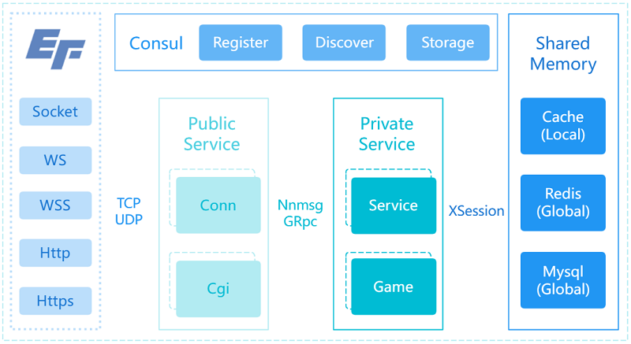

# EF.GO
A LITE GO-BASED FRAMEWORK.

## SUMMARY | 功能概述

- 分布式、高承载、无状态的微服务框架
- 前后端服务分离(private/public)
- 富前端连接，支持socket/ws/wss/http/https等
- 数据模型驱动，orm超集，支持条件表达式，快速开发
- 基于goroutine绑定的session会话结构，内存沙箱，安全稳定
- 动态负载均衡，基于UID均衡分配处理器，提高承载能力

## MANUAL | 使用手册
### Windows
- 安装Golang: go1.18.2.windows-amd64.msi
```
    设置代理：go env -w GOPROXY=https://goproxy.cn,direct（重启或注销系统生效）
```
- VSCode安装Go插件：安装所有go工具（Go: Install/Update Tools）
- VSCode安装ecode-go插件：该插件提供工程的编译调试等功能
- 安装Navicat：navicat121_premium_cs_x64.exe（参考Navicat_Crack.txt进行绿化）
- 安装MySql：mysql-5.5.20-winx64.msi
- 安装Redis：Redis-x64-5.0.10.msi
- 安装Redis管理工具：Another-Redis-Desktop-Manager.1.3.9.exe
- 解压Consul：consul_1.8.3_windows_amd64.zip到对应的路径下，配置自启动
```
	以管理员身份执行：sc.exe create Consul binPath="C:\Programs\Consul_1.8.3\consul.exe agent -dev -ui -client 0.0.0.0"
	启动服务：sc.exe start Consul
	运行services.msc，将Consul设置为自启动
	UI控制台：http://127.0.0.1:8500/ui（使用Chrome访问）
```

### Linux
- 解压安装Golang: go1.18.2.linux-amd64.tar.gz
```
    设置代理：go env -w GOPROXY=https://goproxy.cn,direct
```
- VSCode安装Remote-SSH插件：该插件提供远端服务
- VSCode安装Go插件（远端）：安装所有go工具（Go: Install/Update Tools）
- VSCode安装ecode-go插件（远端）：该插件提供工程的编译调试等功能
- 参考Windows安装Mysql、Redis、Consul相应版本即可，具体步骤略

### Project
- 安装依赖：go mod tidy
- 编译调试：ecode.go

## FAQ | 常见问题

## TODO | 待办事项

## REFER | 引用说明

## LICENSE | 许可声明
- Copyright (C) EFramework, https://eframework.cn, All rights reserved.
- **SEE [LICENSE.md](https://go.eframework.cn/md_LICENSE.html) FOR MORE DETAILS.**

## CHANGELOG | 更新日志
### v1.2.5 [2023.05.28]
- 修复server.ini->env字段读取异常

### v1.2.2 - v1.2.4 [2023.02.13]
- 修复Windows服务器无Golang环境无法初始化Mysql的问题
- 新增xsession.GCount获取数据数量
- 新增xorm.RxSMembers、xorm.RxSCard、xorm.RxLIndex等Redis接口
- 新增xorm.limit限制字段支持
- 优化所有包的注释
- Fix mysql initialization issue on windows server without golang env.
- Add xsession.GCount for getting data count.
- Add xorm.RxSMembers, xorm.RxSCard, xorm.RxLIndex redis api.
- Add xorm.limit field support.
- Optimize packages' comment/document.

### v1.2.1 [2022.10.12]
- 修复xconn网关异常（'close of closed channel'）
- 新增conf.local支持
- 修复xsession注释错误
- fix socket client crash error
- add conf.local support
- fix incorrect xsession comment

### v1.2.0 [2022.09.29]
- 修复xconn网关异常（'close of closed channel'）
- 导出GetFPS和GetTitle接口
- 修改Consul健康检测的返回值（使用win32版本的title替代之）
- fix xconn crash of 'close of closed channel'
- export GetFPS and GetTitle of xserver
- change consul check's response to win32's title

### v1.1.9 [2022.07.22]
- 修改配置文件在linux无法找到.
- fix config path issue in linux.

### v1.1.8 [2022.07.15]
- 修改package(包)的名称.
- change package name.

### v1.1.7 [2022.07.14]
- 修改msg和cgi的协议格式, 支持pb和json, 于server.ini中配置.
- 修改xmsg包为xproto.
- 更新protoc.exe.
- 重构protocol为protos, 区分cpb,mpb,rpb三种, 修改gproto.exe为gopb.exe工具.
- 完善cgi请求超时逻辑.
- 修改cgi默认协议为http.
- change protocol of msg and cgi, support pb and json format, config it at server.ini.
- change xmsg to xproto.
- update protoc.exe.
- refactor protocol to protos, distinct cpb/mpb/rpb, change gproto.exe to gopb.exe.
- finish cgi timeout logic.
- change cgi default protocol to http instead of https.

### v1.1.6 [2022.06.23]
- 修改CGI的访问方式.
- 修改CGIquery的格式.
- change cgi access.
- fix cgi query issue.

### v1.1.5 [2022.05.30]
- 新增WebSocket(tls)的支持
- 新增xmsg.UnpackSID用于解析客户端的保留ID
- 新增xserver.SendCgi的uid参数，用于负载均衡
- 完善若干日志

### v1.1.3 [2022.05.27]
- **[BETA]DO NOT USE THIS TAG!**
- [PROXY]CACHED BY GOPROXY.CN

### v1.1.2 [2022.05.20]
- 重构Frame的类型
- 新增xhttp用于cgi接口
- 重构工程结构private/public